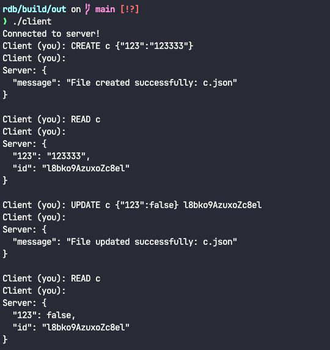

# 📡 C++ Client-Server Room Management System 📡

## 👀 About

A lightweight and efficient C++ application to manage "rooms" and communication over sockets. It enables JSON-based file manipulation, dynamic ID creation, and provides a structured environment for networking and client-server interactions.

All the essentials of a JSON-based “database” over raw sockets, in one place.  
The server listens on a TCP port, handles each connected client in its own thread, and accepts three text commands:  
- **CREATE** 
- **READ** 
- **UPDATE**   

The client is a simple command-line interface that connects to 127.0.0.1 on the chosen port, sends your text commands, and prints whatever the server responds.

---

## 🚀 Technologies

C++

Make

---

## 💻 Getting started

### Requirements

C++ compiler (e.g., g++ or clang++)

CMake

Make

Unix-based system (Linux or macOS)

### Installing and running the project

Clone the repository:

```bash
$ git clone git@github.com/hmartiins/rdb
$ cd rdb
```

Build the project using cmake and make:

```bash
$ cmake .
$ make
```

Run the server and client in separate terminals:

#In one terminal

```bash
$ cd build/out
$ ./server
```
#In another terminal

```bash
$ cd build/out
$ ./client
```

---

### 🖼 Exemple



---

### 📁 Project Structure

```
.
.
├── .github/
│   └── assets/
│       └── Image.jpeg            # Image used in README
├── src/
│   ├── json/
│   │   ├── create-file.hpp       # Create JSON files
│   │   ├── read-file.hpp         # Read JSON files
│   │   └── update-file.hpp       # Update JSON files
│   ├── utils/
│   │   ├── random-id.hpp         # ID generation helper
│   │   └── split.hpp             # String splitting utilities
│   ├── client.cpp                # Client-side application logic
│   ├── room_manager.hpp          # Room control logic
│   ├── server.cpp                # Server-side application logic
│   └── socket_utils.hpp          # Socket helper functions
├── .gitignore
├── CMakeLists.txt                # CMake build config
├── Makefile                      # Alternative build option
└── README.md                     # Project documentation
```

---

## 🛠 Contribution

A big thank you to everyone contributing to the project. Below are some of our main contributors:

- [Henrique Martins](https://github.com/hmartiins)
- [João Victor](https://github.com/joaovds)
- [Gabriel Carvalho](https://github.com/GabrielQuinteiro)
- [Leticia Silverio](https://github.com/devLeSilverio)
- [Vitor Cavicchiolli](https://github.com/Vitorcavic)
- [Rennys Cardoso](https://github.com/yrsenn)

